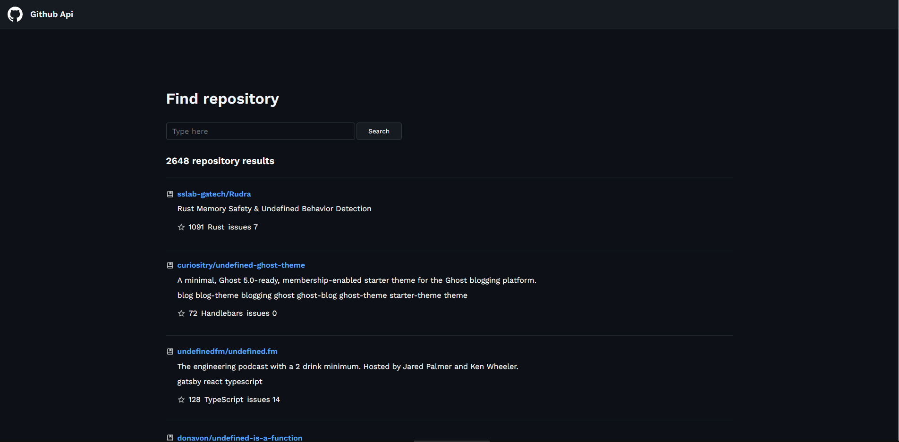
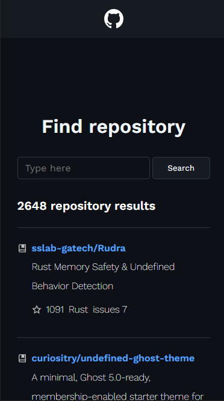

# FieldControlChallengeFront

<div>
   <h2 align="center" style="font-size: 25px;margin-bottom: 2rem;">GitHub Api</h2>
   <div align="center">
    
   </div>
</div>

# Descrição

<div style="margin-bottom:2rem;">

<p style="font-size: 15px">O projeto FieldControl Challenge Front tem como objetivo o desenvolvimento de uma aplicação em Angular 14.0.2 que utilize endpoint da API do github.</p>
</div>

# Layout

|        💻 Desktop         |        📱 Mobile         |
| :-----------------------: | :----------------------: |
|  |  |

# Utilização

<p style="font-size: 15px">É possível você utilizar o projeto seguindos estes passos:</p>
<p style="font-size: 15px">Utilize o Git Clone no repositório em uma pasta de sua escolha</p>

```
$ git clone https://github.com/1995william/GitHub-Api.git
```

<p style="font-size: 15px">Execute o comando a seguir no terminal para instalar as dependências</p>

```
$ npm i
ou
$ npm install
```

<p style="font-size: 15px">Para executar o projeto digite</p>

```
$ ng serve
```

## ou

<p style="font-size: 20px; "><strong>Para acessar o deploy da aplicação:</strong> <a href="http://git-hub-api-kappa.vercel.app/" target="_blank" style="font-size: 20px">clique aqui!</a></p>

<p style="font-size: 15px">Para executar os testes unitários</p>

```
$ ng test
```

# Tecnologias e ferramentas utilizadas

<div >
<ul>
<li>Node</li>
<li>CSS</li>
<li>Angular</li>
<li>TypeScript</li>
<li>Jasmine</li>
<li>Vercel</li>

</ul>

</div>

# Desenvolvedor

<p style="font-size: 15px">Rodrigo William</p>
